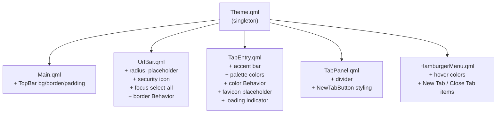

# Design Document: UI Polish

## Overview

This document describes the technical design for the `ui-polish` feature — a comprehensive visual and UX refinement pass across the Lilypad browser's six QML files. The goal is to align all components with the established Lilypad color palette, improve micro-interactions through smooth animations, and add missing UI affordances (security icon, favicon placeholder, animated spinner, accent bar, divider, and new hamburger menu items).

All changes are confined to QML and the `Theme.qml` singleton. No C++ backend changes are required.

### Key Design Decisions

- **Theme-first**: All color changes flow through `Theme.qml`. No hardcoded hex values in component files.
- **Behavior animations**: Focus and hover transitions use QML `Behavior` blocks rather than `NumberAnimation` or `PropertyAnimation` at the call site, keeping animation logic co-located with the property it animates.
- **Favicon placeholder over image**: The existing `faviconLabel` `Label` is replaced by a small `Item` that switches between three child states: loading indicator, favicon image, and initial-letter placeholder.
- **No new C++ types**: The `mutedBalticBlue` color and all new visual elements are pure QML/Theme additions.

---

## Architecture

The feature touches six files in a layered dependency order:

```
Theme.qml          ← foundation (color constants)
    ↓
UrlBar.qml         ← security icon, radius, focus behavior
TabEntry.qml       ← accent bar, favicon placeholder, loading indicator, color transitions
TabPanel.qml       ← divider, new-tab button styling
HamburgerMenu.qml  ← hover colors, new menu items
Main.qml           ← top bar background, border, padding
```

`Theme.qml` must be updated first because every other file reads from it. The component files are independent of each other and can be updated in any order after `Theme.qml`.

### Mermaid Component Diagram



---

## Components and Interfaces

### Theme.qml

**New property:**
```qml
readonly property color mutedBalticBlue: "#0f4070"
```

**Updated properties:**
```qml
readonly property color darkUrlBar: shadowGrey      // was "#1a1a1a"
readonly property color darkHover:  mutedBalticBlue // was balticBlue
```

No interface changes — `Theme` remains a pragma Singleton `QtObject`.

---

### UrlBar.qml

**Changes:**
- Wrap the existing `TextField` in a containing `Item` (or use `leftInset` / `leftPadding`) to host the security icon `Label`.
- Add a `Label` (id: `securityIcon`) anchored to the left of the text input area.
- Set `background.radius: 6`.
- Change `placeholderText` to `"Search or enter address"`.
- Add `onActiveFocusChanged: if (activeFocus) selectAll()`.
- Add a `Behavior on border.color { ColorAnimation { duration: 80 } }` inside the background `Rectangle`.
- Set `leftPadding` to `28` (icon width 16 + 4px gap on each side) to prevent text/icon overlap.

**Security icon logic:**
```qml
Label {
    id: securityIcon
    text: urlBar.text.startsWith("https://") ? "🔒" : "🌐"
    // anchored left inside the TextField
}
```

**Interface:** No new signals or properties exposed to parent. The `navigateRequested(string url)` signal is unchanged.

---

### TabEntry.qml

**Changes:**

1. **Accent bar** — add a `Rectangle` (id: `accentBar`) as a direct child of the root `Rectangle`, anchored to the left edge:
   ```qml
   Rectangle {
       id: accentBar
       width: 3
       anchors { left: parent.left; top: parent.top; bottom: parent.bottom }
       color: Theme.darkEmerald
       visible: isActive
   }
   ```

2. **Active background colors** — update the `color` binding:
   ```qml
   color: {
       if (isActive) return darkMode ? Theme.balticBlue : Theme.petalFrost
       if (hoverHandler.hovered) return darkMode ? Theme.darkHover : Theme.lightHover
       return darkMode ? Theme.darkSurface : Theme.lightSurface
   }
   ```

3. **Color transition** — add inside the root `Rectangle`:
   ```qml
   Behavior on color { ColorAnimation { duration: 90 } }
   ```

4. **Favicon area** — replace the `Label` (id: `faviconLabel`) with a small `Item` (id: `faviconArea`, 16×16) containing three mutually exclusive children:
   - `RotationAnimator`-driven `Rectangle` ring (loading indicator, visible when `tabEntry.isLoading`)
   - `Image` (favicon, visible when favicon available and not loading)
   - `Rectangle` placeholder with initial-letter `Text` (visible when no favicon and not loading)

**Interface:** No new signals or properties. Existing `tabClicked()` and `tabClosed()` signals are unchanged.

---

### TabPanel.qml

**Changes:**

1. **Divider** — add a `Rectangle` between the `ScrollView` and the `Button`:
   ```qml
   Rectangle {
       width: parent.width
       height: 1
       color: root.darkMode ? Theme.darkBorder : Theme.lightBorder
   }
   ```
   The `Column` layout places this automatically between the scroll area and the button.

2. **NewTabButton** — update height to `48`, add a left-border `Rectangle` (3px, `Theme.darkEmerald`), and set text color to `Theme.darkEmerald` unconditionally.

**Interface:** No changes to the public API of `TabPanel`.

---

### HamburgerMenu.qml

**Changes:**

1. **Hover color** — update the background `Rectangle` color binding:
   ```qml
   color: parent.hovered
       ? (root.darkMode ? Theme.mutedBalticBlue : Theme.petalFrost)
       : "transparent"
   ```

2. **New menu items** — add two `MenuItem` entries after the existing "Dark Mode" item:
   ```qml
   MenuItem {
       text: "New Tab"
       onTriggered: tabManager.createTab("https://polli.page")
       // background + contentItem styled with petalFrost / mutedBalticBlue hover
   }
   MenuItem {
       text: "Close Tab"
       onTriggered: tabManager.closeTab(tabManager.activeTabId)
       // same hover styling
   }
   ```

**Interface:** No new signals. The existing `darkModeToggled(bool)` signal is unchanged.

---

### Main.qml

**Changes:**

1. **TopBar background** — wrap the existing `RowLayout` in a `Rectangle` (or add a `Rectangle` background behind it) with:
   ```qml
   color: window.darkMode ? Theme.shadowGrey : Theme.softLinen
   ```

2. **Bottom border** — add a 1px `Rectangle` at the bottom of the top bar area:
   ```qml
   Rectangle {
       anchors { left: parent.left; right: parent.right; bottom: parent.bottom }
       height: 1
       color: window.darkMode ? Theme.darkBorder : Theme.lightBorder
   }
   ```

3. **Top padding** — set `anchors.topMargin: 4` (or `topPadding: 4`) on the `RowLayout` so the URL bar has breathing room from the window edge.

**Interface:** No changes to the public API of `Main.qml`.

---

## Data Models

This feature introduces no new data models. All changes are presentational bindings on existing QML properties:

| Property | Type | Source | Consumer |
|---|---|---|---|
| `darkMode` | `bool` | `Main.qml` (window) | All components via property binding |
| `tabEntry.isLoading` | `bool` | `TabManager` model | `TabEntry` favicon area |
| `tabEntry.favicon` | `QIcon` / `url` | `TabManager` model | `TabEntry` favicon image |
| `tabEntry.title` | `string` | `TabManager` model | `TabEntry` placeholder initial |
| `urlBar.text` | `string` | User input / `onUrlChanged` | Security icon expression |
| `Theme.*` | `color` | `Theme.qml` singleton | All components |

The new `mutedBalticBlue` color is a compile-time constant in `Theme.qml` — no runtime data flow.

---

## Correctness Properties

*A property is a characteristic or behavior that should hold true across all valid executions of a system — essentially, a formal statement about what the system should do. Properties serve as the bridge between human-readable specifications and machine-verifiable correctness guarantees.*

This feature is primarily a QML UI styling and micro-interaction pass. Most acceptance criteria are static property checks (correct color value, correct pixel size, correct animation duration) that are best verified with targeted example-based tests. However, three behavioral rules vary meaningfully with input and are suitable for property-based testing:

### Property 1: Security Icon Reflects URL Scheme

*For any* string set as the URL bar text, the security icon label SHALL display "🔒" if and only if the string starts with "https://", and SHALL display "🌐" otherwise.

**Validates: Requirements 4.1, 4.2**

---

### Property 2: URL Bar Selects All Text on Focus

*For any* non-empty string set as the URL bar text, when the URL bar receives active focus, the `selectedText` property SHALL equal the full `text` property.

**Validates: Requirements 3.1**

---

### Property 3: Accent Bar Visibility Matches Active State

*For any* `TabEntry`, the accent bar `Rectangle` SHALL be visible if and only if `isActive` is `true`.

**Validates: Requirements 5.1, 5.2**

---

### Property 4: Favicon Placeholder Shows Correct Initial

*For any* `TabEntry` whose `tabEntry.title` is non-empty, `tabEntry.isLoading` is `false`, and no favicon image is available, the `FaviconPlaceholder` SHALL display exactly the first character of `tabEntry.title`.

**Validates: Requirements 8.1**

---

### Property 5: Favicon Display Priority Ordering

*For any* `TabEntry`, the display state SHALL satisfy the following exclusive priority:
1. If `tabEntry.isLoading` is `true` → LoadingIndicator visible, FaviconPlaceholder and favicon image not visible.
2. Else if a favicon image is available → favicon image visible, LoadingIndicator and FaviconPlaceholder not visible.
3. Else → FaviconPlaceholder visible, LoadingIndicator and favicon image not visible.

**Validates: Requirements 8.1, 8.2, 8.3**

---

## Error Handling

### Invalid or Empty Tab Title for Placeholder

If `tabEntry.title` is an empty string and no favicon is available, the placeholder initial letter would be empty. The implementation SHALL guard against this:

```qml
text: (tabEntry && tabEntry.title && tabEntry.title.length > 0)
    ? tabEntry.title[0].toUpperCase()
    : "?"
```

A "?" fallback ensures the placeholder is always visually meaningful.

### Favicon Image Load Failure

If the favicon `Image` source fails to load (`Image.Error` status), the component SHALL fall back to the `FaviconPlaceholder`. This is handled by binding `faviconImage.visible` to `faviconImage.status === Image.Ready`.

### URL Bar Text During Navigation

The security icon expression reads `urlBar.text` directly. During navigation, `urlBar.text` is updated by `onUrlChanged` in `Main.qml`. No special error handling is needed — the expression re-evaluates reactively on every text change.

### Theme Property Access

All `Theme.*` references are to a `pragma Singleton` — they are always available at runtime. No null-guard is needed.

---

## Testing Strategy

### Approach

This feature is a QML UI polish pass. The testing strategy uses:

- **QML test files** (`tst_*.qml`) using `QtTest` for example-based checks of static properties (colors, sizes, animation durations, placeholder text).
- **Property-based tests** using `rapidcheck` + `QtTest` (C++) for the five behavioral properties identified above, following the existing project pattern in `tests/`.

### Unit / Example Tests (QML)

Each of the following is a targeted example-based check:

| Test | Requirement |
|---|---|
| TopBar background color in light/dark mode | 1.1 |
| TopBar bottom border color and height | 1.2 |
| TopBar top padding == 4 | 1.3 |
| UrlBar background radius == 6 | 2.1 |
| UrlBar placeholderText == "Search or enter address" | 2.2 |
| UrlBar border.color Behavior duration == 80 | 3.2 |
| UrlBar leftPadding > 24 | 4.3 |
| TabEntry background == petalFrost when isActive=true, darkMode=false | 6.1 |
| TabEntry background == balticBlue when isActive=true, darkMode=true | 6.2 |
| TabEntry color Behavior duration == 90 | 7.1 |
| LoadingIndicator is a styled Rectangle (not "⟳" text) | 9.1 |
| LoadingIndicator RotationAnimator duration == 800, loops == Infinite | 9.2 |
| NewTabButton height == 48 | 10.1 |
| NewTabButton left border width == 3, color == darkEmerald | 10.2 |
| NewTabButton text color == darkEmerald in both modes | 10.3 |
| TabPanel divider height == 1, correct color per mode | 11.1 |
| HamburgerMenu hover color == petalFrost (light) / mutedBalticBlue (dark) | 12.1, 12.2 |
| HamburgerMenu "New Tab" item triggers createTab | 13.1 |
| HamburgerMenu "Close Tab" item triggers closeTab | 13.2 |
| HamburgerMenu menu item hover colors | 13.3 |
| Theme.mutedBalticBlue == "#0f4070" | 14.1 |
| Theme.darkUrlBar == Theme.shadowGrey | 14.2 |
| Theme.darkHover == Theme.mutedBalticBlue | 14.3 |

### Property-Based Tests (C++ / rapidcheck)

Following the project's existing pattern (`tests/test_tab_entry_widget.cpp`, `tests/test_tab_manager_props.cpp`), property tests are written in C++ using `rapidcheck` + `QtTest`. Since the QML layer is not directly testable from C++ property tests, the behavioral logic (security icon selection, select-all, accent bar visibility, favicon priority) is extracted into small pure C++ helper functions or tested via the QML `TestCase` component with generated inputs.

**Property test configuration:**
- Minimum 100 iterations per property (rapidcheck default)
- Each test tagged with: `Feature: ui-polish, Property N: <property_text>`

**Property 1 — Security icon reflects URL scheme**
```
Feature: ui-polish, Property 1: security icon shows lock iff URL starts with https://
```
Generate random strings; partition into https:// and non-https://; verify icon text.

**Property 2 — URL bar selects all text on focus**
```
Feature: ui-polish, Property 2: urlBar.selectedText == urlBar.text after focus
```
Generate random non-empty strings; set as urlBar.text; trigger focus; assert selectedText == text.

**Property 3 — Accent bar visibility matches isActive**
```
Feature: ui-polish, Property 3: accentBar.visible iff isActive
```
Generate random boolean isActive values; verify accentBar.visible matches.

**Property 4 — Favicon placeholder shows correct initial**
```
Feature: ui-polish, Property 4: placeholder initial == title[0] for any non-empty title
```
Generate random non-empty strings as tab titles; verify placeholder text == title[0].toUpperCase().

**Property 5 — Favicon display priority ordering**
```
Feature: ui-polish, Property 5: exactly one of {loadingIndicator, faviconImage, placeholder} is visible
```
Generate random combinations of (isLoading, hasFavicon); verify exactly one display element is visible and it is the correct one per priority order.
