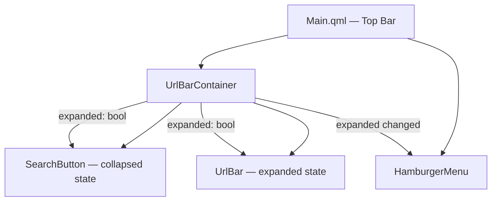
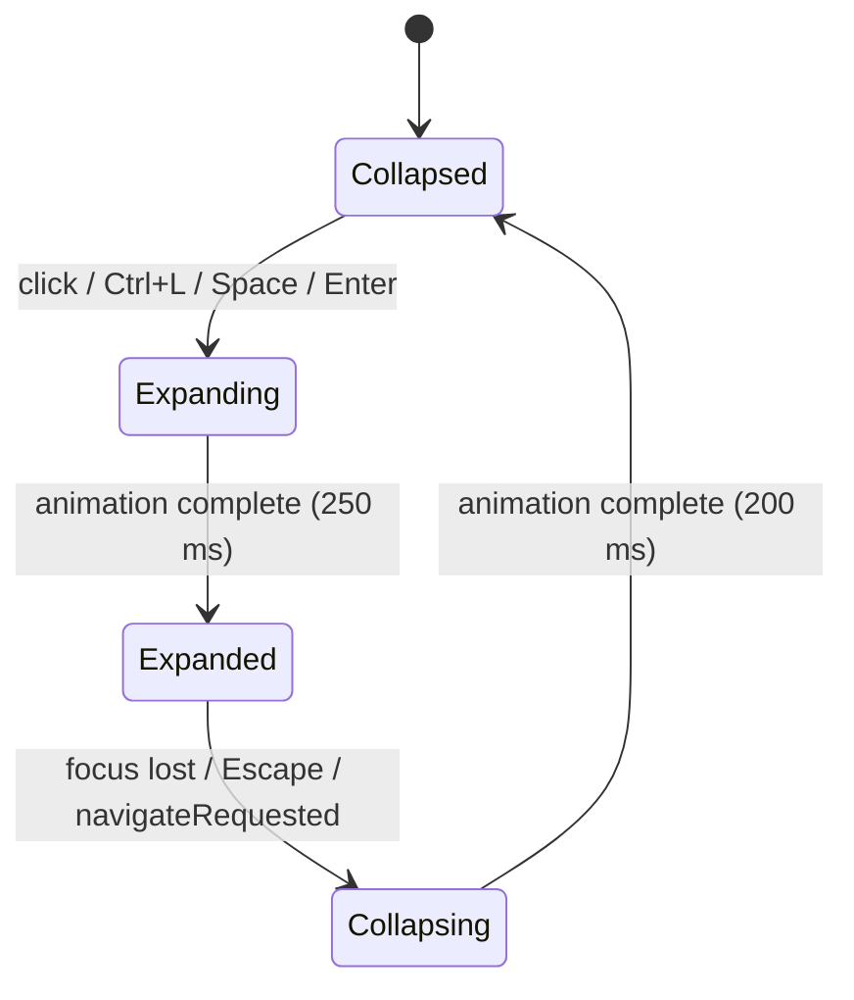

# Design Document: URL Bar Expand Animation

## Overview

This feature replaces the always-visible, full-width URL bar in Lilypad's top bar with a compact circular search button. Clicking the button triggers a fluid expand animation that grows the button into a full-width text input. When the user finishes (focus lost or Escape pressed), a collapse animation returns the bar to its compact state. All existing navigation and URL-sync behaviour is preserved.

The design introduces a new `SearchButton` component and refactors `UrlBar.qml` to support an animated expand/collapse lifecycle, while keeping `Main.qml` changes minimal.

---

## Architecture

The feature is implemented entirely in QML. No C++ changes are required.



### State Machine

The top bar has two states: **collapsed** (Search_Button visible) and **expanded** (Url_Bar visible). A single boolean property `expanded` drives both the visual state and the animations.



### Component Responsibilities

| Component | Responsibility |
|---|---|
| `Main.qml` | Hosts `UrlBarContainer` and `HamburgerMenu`; passes `darkMode`; handles `navigateRequested` |
| `UrlBarContainer.qml` | Owns the `expanded` state; orchestrates expand/collapse animations; contains `SearchButton` and `UrlBar` |
| `SearchButton.qml` | Circular button; emits `expandRequested`; handles hover, Tab focus, Space/Enter keys |
| `UrlBar.qml` | Text input; emits `navigateRequested`; handles Escape; displays security icon |

---

## Components and Interfaces

### UrlBarContainer.qml

```qml
// Public API
property bool darkMode: false
property bool expanded: false
property string currentUrl: ""

signal navigateRequested(string url)

// Internal
function expand()   // triggers Expand_Animation
function collapse() // triggers Collapse_Animation
```

The container uses a `NumberAnimation` on its own `width` and on the background `Rectangle`'s `radius`. It also drives the `HamburgerMenu` offset via a property binding exposed to `Main.qml`.

**Hamburger menu slide-out**: `Main.qml` binds `HamburgerMenu.x` (or `Layout.rightMargin`) to a value that shifts it off-screen when `urlBarContainer.expanded === true`, animated with the same 250 ms / 200 ms durations.

### SearchButton.qml

```qml
property bool darkMode: false

signal expandRequested()

// Visual: 40×40 circle, Theme.darkEmerald background
// Hover: Theme.darkHover (dark) / Theme.lightHover (light)
// Icon: "🔍" centred
// Keys: Space, Enter → expandRequested()
// Focus: activeFocusOnTab: true
```

### UrlBar.qml (updated)

The existing `UrlBar.qml` is updated to:
- Accept an `expanded` property that controls `visible` of the text input and security icon
- Keep `placeholderText`, `navigateRequested`, `onAccepted`, and Escape handling unchanged
- Remove the fixed `height: 40` — height is now managed by the container

```qml
property bool darkMode: false
property bool expanded: false   // NEW
property string currentUrl: ""  // NEW — synced from outside

signal navigateRequested(string url)
```

### Main.qml changes

Replace the `UrlBar` item in the `RowLayout` with `UrlBarContainer`. Add a `Behavior` on `HamburgerMenu`'s `Layout.rightMargin` (or `x` offset) to animate the slide-out.

---

## Data Models

No new persistent data models are introduced. The only state is:

| Property | Type | Owner | Description |
|---|---|---|---|
| `expanded` | `bool` | `UrlBarContainer` | Whether the URL bar is in expanded state |
| `currentUrl` | `string` | `UrlBarContainer` | The URL currently displayed (synced from active tab) |
| `darkMode` | `bool` | `Main.qml` (propagated) | Current theme mode |

---

## Correctness Properties

*A property is a characteristic or behavior that should hold true across all valid executions of a system — essentially, a formal statement about what the system should do. Properties serve as the bridge between human-readable specifications and machine-verifiable correctness guarantees.*

### Property 1: Text is fully selected on expand

*For any* text content present in the URL bar when the expand animation completes, all text in the input field SHALL be selected (i.e., `selectionStart === 0` and `selectionEnd === text.length`).

**Validates: Requirements 2.5**

---

### Property 2: Navigation emitted for any non-empty text

*For any* non-empty string entered in the URL bar, pressing Enter SHALL cause the `navigateRequested` signal to be emitted with the processed form of that string.

**Validates: Requirements 4.1**

---

### Property 3: URL bar text always reflects active tab URL

*For any* URL string associated with the active tab (whether the URL bar is expanded or collapsed, and whether the URL changed due to navigation or tab switching), the URL bar's internal `text` property SHALL equal the active tab's current URL.

**Validates: Requirements 4.3, 4.4**

---

### Property 4: Security icon correctly reflects URL scheme

*For any* URL string displayed in the expanded URL bar, the security icon SHALL display "🔒" if and only if the URL begins with `https://`, and "🌐" otherwise.

**Validates: Requirements 5.1, 5.2**

---

## Error Handling

| Scenario | Handling |
|---|---|
| `urlProcessor.process()` returns an empty string | `navigateRequested` is not emitted; collapse still occurs |
| Expand triggered while already expanded | No-op; animation does not restart |
| Collapse triggered while already collapsed | No-op |
| `currentUrl` set to empty string | URL bar text is cleared; security icon shows "🌐" |
| Window resized during animation | Width animation target recalculates from `parent.width`; QML bindings handle this automatically |
| Ctrl+L pressed while expanded | No-op (bar is already expanded) |

---

## Testing Strategy

### Dual Testing Approach

Unit/example-based tests cover specific states and configurations. Property-based tests verify universal invariants across a range of generated inputs.

### Property-Based Testing

The feature involves pure logic functions (text selection, signal emission, URL sync, security icon selection) that are well-suited to property-based testing. The QML test suite uses `QtTest`, which does not have a built-in PBT library. Property tests are implemented using a lightweight generator loop pattern (100+ iterations with randomised inputs) within `QtTest` `TestCase` functions.

Each property test MUST run a minimum of **100 iterations** with randomised inputs.

Tag format: `// Feature: url-bar-expand-animation, Property N: <property text>`

#### Property 1 — Text fully selected on expand
- Generate random strings of varying length and content
- Set `urlBar.text` to each string, trigger expand, verify `selectionStart === 0` and `selectionEnd === text.length`
- Tag: `Feature: url-bar-expand-animation, Property 1: text is fully selected on expand`

#### Property 2 — Navigation emitted for any non-empty text
- Generate random non-empty strings
- Set as URL bar text, simulate Enter key press
- Verify `navigateRequested` was emitted with a non-empty processed URL
- Tag: `Feature: url-bar-expand-animation, Property 2: navigation emitted for any non-empty text`

#### Property 3 — URL bar text reflects active tab URL
- Generate random URL strings
- Set `currentUrl` on the container (simulating tab URL change and tab switch)
- Verify `urlBar.text === currentUrl` in both expanded and collapsed states
- Tag: `Feature: url-bar-expand-animation, Property 3: URL bar text always reflects active tab URL`

#### Property 4 — Security icon reflects URL scheme
- Generate random URL strings, half prefixed with `https://`, half without
- Verify icon text is "🔒" for https URLs and "🌐" for all others
- Tag: `Feature: url-bar-expand-animation, Property 4: security icon correctly reflects URL scheme`

### Unit / Example-Based Tests

These cover the static configuration and specific state transitions that are not suited to property testing:

| Test | Validates |
|---|---|
| SearchButton diameter === 40, radius === 20 | Req 1.1 |
| SearchButton icon text === "🔍" | Req 1.2 |
| SearchButton background === Theme.darkEmerald (both modes) | Req 1.4, 1.5 |
| SearchButton hover color (light/dark) | Req 1.6 |
| Expand animation duration === 250, easing === OutCubic | Req 2.3 |
| Collapse animation duration === 200, easing === InCubic | Req 3.3 |
| Collapsed width === 40, expanded width === parent width | Req 2.6, 3.5 |
| Collapsed radius === 20, expanded radius === 6 | Req 2.7, 3.6 |
| Security icon hidden when collapsed | Req 5.3 |
| TextField hidden when collapsed, visible when expanded | Req 3.7 |
| Hamburger menu slides out on expand, returns on collapse | Req 2.2, 3.4 |
| Ctrl+L triggers expand | Req 7.1 |
| Space/Enter on focused SearchButton triggers expand | Req 7.4 |
| SearchButton has activeFocusOnTab: true | Req 7.3 |
| Empty text + Enter → no navigateRequested signal | Req 4.5 |
| Focus loss → collapse | Req 3.1 |
| Escape key → collapse | Req 3.2, 7.2 |
| navigateRequested → collapse | Req 4.2 |
| UrlBar background color (dark/light mode) | Req 6.1, 6.2 |
| UrlBar text color (dark/light mode) | Req 6.3, 6.4 |
| UrlBar border color (focused / unfocused, dark/light) | Req 6.5, 6.6 |

### Test File Location

New test file: `tests/qml/tst_urlbar_expand_animation.qml`

Existing `tests/qml/tst_urlbar_props.qml` may need minor updates if `UrlBar.qml`'s public API changes (e.g., the `expanded` property is added).
