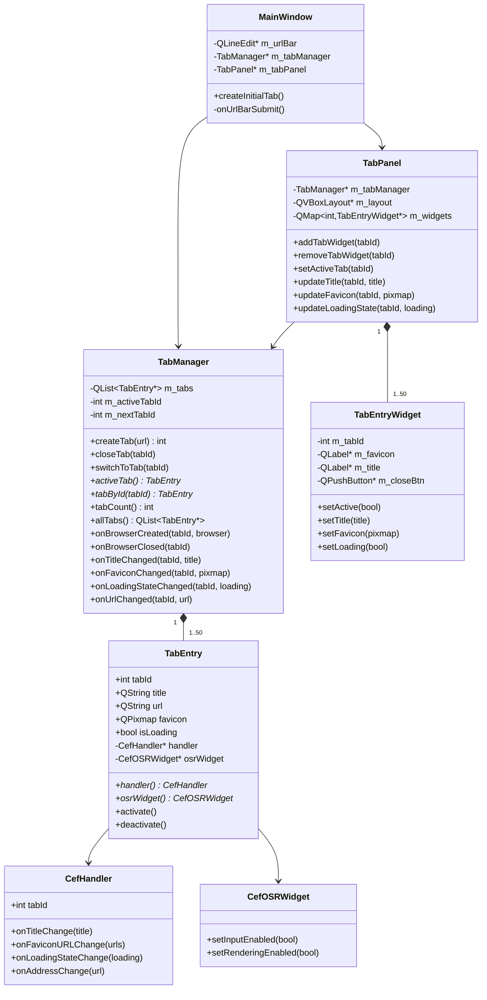
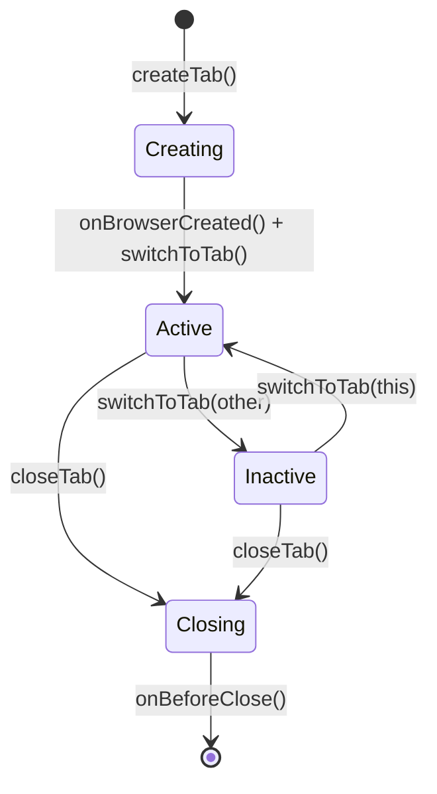

# Design Document: Vertical Tab Panel

## Overview

The vertical tab panel feature transforms Lilypad from a single-tab browser into a multi-tab browser. The existing architecture has one `CefHandler` and one `CefOSRWidget` owned directly by `MainWindow`. This design introduces a `TabManager` that owns a collection of `TabEntry` objects, each pairing a `CefHandler` with a `CefOSRWidget`. A new `TabPanel` sidebar widget renders the tab list on the left side of the window.

The key design goals are:

- **Correctness**: CEF's multi-threaded lifecycle (browser creation on the CEF UI thread, `OnBeforeClose` before handler release) must be respected to avoid crashes and leaks.
- **Input isolation**: Only the active tab's `CefOSRWidget` receives input events and paint callbacks.
- **Resource efficiency**: Background tabs have rendering suspended via `WasHidden(true)`.
- **Minimal disruption**: The existing `CefHandler` and `CefOSRWidget` classes are extended rather than replaced; `MainWindow` is refactored to delegate tab management to `TabManager`.

---

## Architecture

### High-Level Layout

```
┌─────────────────────────────────────────────────────────┐
│  URL Bar (QLineEdit, full width)                        │
├──────────────┬──────────────────────────────────────────┤
│  TabPanel    │  CefOSRWidget (active tab, fills space)  │
│  (fixed      │                                          │
│   width)     │                                          │
│              │                                          │
│  [Tab 1]     │                                          │
│  [Tab 2] ◄── │  ← only active OSR widget is visible    │
│  [Tab 3]     │                                          │
│  [+ New]     │                                          │
└──────────────┴──────────────────────────────────────────┘
```

### Component Relationships



### Thread Model

CEF uses its own internal threads. The Qt main thread drives the UI and calls `CefDoMessageLoopWork()` on a 10 ms timer (existing pattern). The design follows these rules:

- **Tab creation**: `CefBrowserHost::CreateBrowser` is called from the Qt main thread (which is also the CEF UI thread in single-process mode with `CefDoMessageLoopWork`).
- **`OnAfterCreated` / `OnBeforeClose`**: These CEF callbacks fire on the CEF UI thread. Since the app uses `CefDoMessageLoopWork` on the Qt main thread, these callbacks execute on the Qt main thread, making direct Qt calls safe.
- **`OnPaint`**: Fires on the CEF UI thread (Qt main thread here). The existing `QImage::copy()` pattern is preserved.
- **Tab list mutation**: All mutations to `m_tabs` happen on the Qt main thread, serialized by the Qt event loop.

---

## Components and Interfaces

### `TabEntry`

Owns one `CefHandler` and one `CefOSRWidget`. Responsible for activating/deactivating its own OSR widget and CEF rendering state.

```cpp
// src/tab_entry.h
struct TabEntry {
    int         tabId;
    QString     title;
    QString     url;
    QPixmap     favicon;
    bool        isLoading = false;

    CefHandler*   handler   = nullptr;
    CefOSRWidget* osrWidget = nullptr;

    // Show widget, enable input, resume CEF rendering
    void activate();
    // Hide widget, disable input, suspend CEF rendering
    void deactivate();
};
```

`activate()` calls:
1. `osrWidget->show()`
2. `osrWidget->setInputEnabled(true)`
3. `handler->GetBrowser()->GetHost()->WasHidden(false)` (if browser is ready)
4. `osrWidget->setFocus()`

`deactivate()` calls:
1. `osrWidget->hide()`
2. `osrWidget->setInputEnabled(false)`
3. `handler->GetBrowser()->GetHost()->WasHidden(true)` (if browser is ready)

### `TabManager`

Central coordinator. Owns all `TabEntry` instances. Emits Qt signals for UI updates.

```cpp
// src/tab_manager.h
class TabManager : public QObject {
    Q_OBJECT
public:
    explicit TabManager(QWidget* osrParent, QObject* parent = nullptr);

    int  createTab(const QString& url);   // returns tabId; -1 if at limit
    void closeTab(int tabId);
    void switchToTab(int tabId);

    TabEntry* activeTab() const;
    TabEntry* tabById(int tabId) const;
    int       tabCount() const;
    QList<TabEntry*> allTabs() const;

    // Called by CefHandler callbacks
    void onBrowserCreated(int tabId, CefRefPtr<CefBrowser> browser);
    void onBeforeClose(int tabId);
    void onTitleChanged(int tabId, const QString& title);
    void onFaviconChanged(int tabId, const QPixmap& pixmap);
    void onLoadingStateChanged(int tabId, bool isLoading);
    void onUrlChanged(int tabId, const QString& url);

signals:
    void tabCreated(int tabId);
    void tabClosed(int tabId);
    void activeTabChanged(int oldTabId, int newTabId);
    void titleChanged(int tabId, const QString& title);
    void faviconChanged(int tabId, const QPixmap& pixmap);
    void loadingStateChanged(int tabId, bool isLoading);
    void urlChanged(int tabId, const QString& url);

private:
    QList<TabEntry*> m_tabs;
    int              m_activeTabId = -1;
    int              m_nextTabId   = 1;
    QWidget*         m_osrParent;

    static constexpr int kMaxTabs = 50;
};
```

### `CefHandler` Extensions

`CefHandler` gains a `tabId` member and implements additional CEF callbacks to forward lifecycle events to `TabManager`. It also implements `CefDisplayHandler` for title/URL/favicon updates.

New CEF interfaces implemented:
- `CefDisplayHandler` — `OnTitleChange`, `OnAddressChange`, `OnFaviconURLChange`
- `CefLoadHandler` — `OnLoadingStateChange`

The handler calls back into `TabManager` via direct method calls (safe because both run on the Qt main thread).

```cpp
// Additional members in CefHandler
int tabId = -1;
TabManager* m_tabManager = nullptr;  // non-owning

// New overrides
CefRefPtr<CefDisplayHandler> GetDisplayHandler() override { return this; }
CefRefPtr<CefLoadHandler>    GetLoadHandler()    override { return this; }

void OnTitleChange(CefRefPtr<CefBrowser>, const CefString& title) override;
void OnAddressChange(CefRefPtr<CefBrowser>, CefRefPtr<CefFrame>, const CefString& url) override;
void OnFaviconURLChange(CefRefPtr<CefBrowser>, const std::vector<CefString>& urls) override;
void OnLoadingStateChange(CefRefPtr<CefBrowser>, bool isLoading, bool canGoBack, bool canGoForward) override;
```

Favicon loading: `OnFaviconURLChange` receives a list of URLs. The handler downloads the first URL using `CefURLRequest` and converts the response bytes to a `QPixmap`, then calls `m_tabManager->onFaviconChanged(tabId, pixmap)`.

### `CefOSRWidget` Extensions

Two new control flags are added:

```cpp
// New members
bool m_inputEnabled   = true;
bool m_renderEnabled  = true;

void setInputEnabled(bool enabled);   // gates all mouse/keyboard forwarding
void setRenderEnabled(bool enabled);  // gates OnPaint-triggered repaints
```

`paintEvent` checks `m_renderEnabled`; if false, it skips drawing. All mouse/keyboard event handlers check `m_inputEnabled` before forwarding to CEF.

### `TabPanel`

A `QWidget` with a fixed width (220 px by default) containing a `QScrollArea` for the tab list and a "New Tab" button at the bottom.

```cpp
// src/tab_panel.h
class TabPanel : public QWidget {
    Q_OBJECT
public:
    explicit TabPanel(TabManager* manager, QWidget* parent = nullptr);

signals:
    void newTabRequested();
    void tabCloseRequested(int tabId);
    void tabSwitchRequested(int tabId);

private slots:
    void onTabCreated(int tabId);
    void onTabClosed(int tabId);
    void onActiveTabChanged(int oldId, int newId);
    void onTitleChanged(int tabId, const QString& title);
    void onFaviconChanged(int tabId, const QPixmap& pixmap);
    void onLoadingStateChanged(int tabId, bool isLoading);

private:
    TabManager*              m_tabManager;
    QVBoxLayout*             m_listLayout;
    QMap<int, TabEntryWidget*> m_widgets;
    QPushButton*             m_newTabBtn;

    static constexpr int kPanelWidth = 220;
};
```

### `TabEntryWidget`

A `QFrame` subclass representing one row in the tab panel.

```cpp
// src/tab_entry_widget.h
class TabEntryWidget : public QFrame {
    Q_OBJECT
public:
    explicit TabEntryWidget(int tabId, QWidget* parent = nullptr);

    void setActive(bool active);
    void setTitle(const QString& title);
    void setFavicon(const QPixmap& pixmap);
    void setLoading(bool loading);

signals:
    void clicked(int tabId);
    void closeClicked(int tabId);

protected:
    void mousePressEvent(QMouseEvent* event) override;
    void enterEvent(QEnterEvent* event) override;
    void leaveEvent(QEvent* event) override;

private:
    int          m_tabId;
    QLabel*      m_faviconLabel;
    QLabel*      m_titleLabel;
    QPushButton* m_closeBtn;
    QMovie*      m_loadingSpinner = nullptr;  // animated spinner for loading state
};
```

Active tab styling uses a distinct background color (e.g., `palette().highlight()`). Hover state uses a lighter tint applied via `enterEvent`/`leaveEvent`.

### `MainWindow` Refactor

`MainWindow` is simplified: it no longer owns `CefHandler` or `CefOSRWidget` directly. It owns `TabManager` and `TabPanel`, and wires their signals together.

```cpp
// src/mainwindow.h (revised)
class MainWindow : public QMainWindow {
    Q_OBJECT
public:
    explicit MainWindow(QWidget* parent = nullptr);
    void createInitialTab();

private slots:
    void onUrlBarSubmit();
    void onActiveTabChanged(int oldId, int newId);
    void onUrlChanged(int tabId, const QString& url);

private:
    QLineEdit*   m_urlBar;
    TabManager*  m_tabManager;
    TabPanel*    m_tabPanel;
    QWidget*     m_osrContainer;  // parent widget for all OSR widgets
};
```

Layout uses `QHBoxLayout` for the tab panel + OSR container, wrapped in a `QVBoxLayout` with the URL bar on top.

---

## Data Models

### `TabEntry` State

| Field       | Type           | Description                                      |
|-------------|----------------|--------------------------------------------------|
| `tabId`     | `int`          | Unique, monotonically increasing, never reused   |
| `title`     | `QString`      | Current page title; falls back to URL if empty   |
| `url`       | `QString`      | Current URL of the browser frame                 |
| `favicon`   | `QPixmap`      | 16×16 favicon; default placeholder if not loaded |
| `isLoading` | `bool`         | True while the browser is loading a page         |
| `handler`   | `CefHandler*`  | Owned pointer; released after `OnBeforeClose`    |
| `osrWidget` | `CefOSRWidget*`| Owned pointer; deleted after handler is released |

### `TabManager` State

| Field          | Type                | Description                                    |
|----------------|---------------------|------------------------------------------------|
| `m_tabs`       | `QList<TabEntry*>`  | Ordered list; index 0 = first opened tab       |
| `m_activeTabId`| `int`               | Tab ID of the currently active tab; -1 if none |
| `m_nextTabId`  | `int`               | Monotonically increasing counter; starts at 1  |

### Tab Lifecycle State Machine



### Default New-Tab URL

The default URL for new tabs is `"about:blank"`. This can be changed to any URL string without affecting the architecture.

---

## Correctness Properties

*A property is a characteristic or behavior that should hold true across all valid executions of a system — essentially, a formal statement about what the system should do. Properties serve as the bridge between human-readable specifications and machine-verifiable correctness guarantees.*

### Property 1: Tab count invariant after creation

*For any* `TabManager` with fewer than 50 open tabs, calling `createTab()` with a valid URL shall increase `tabCount()` by exactly 1, and the resulting `TabEntry` shall have a non-null `handler` and `osrWidget`.

**Validates: Requirements 3.2, 3.3, 3.5**

---

### Property 2: Tab count cap enforcement

*For any* `TabManager` that already has 50 open tabs, calling `createTab()` shall return -1 and leave `tabCount()` unchanged at 50.

**Validates: Requirements 3.5, 3.6**

---

### Property 3: Tab ID uniqueness across a session

*For any* sequence of `createTab()` and `closeTab()` operations within a session, all Tab IDs ever assigned shall be distinct — no Tab ID shall be reused after a tab is closed.

**Validates: Requirements 3.2, 5.6**

---

### Property 4: New tab becomes active

*For any* `TabManager` state, after a successful `createTab()` call, `activeTab()->tabId` shall equal the newly returned Tab ID.

**Validates: Requirements 3.4**

---

### Property 5: Active tab and OSR visibility invariant after switch

*For any* `TabManager` with at least one tab, after calling `switchToTab(id)` for a valid `id`, `activeTab()->tabId` shall equal `id`, exactly one `CefOSRWidget` (the one belonging to `id`) shall be visible, and all other `CefOSRWidget` instances shall be hidden with input disabled.

**Validates: Requirements 4.1, 4.2, 9.1, 9.2, 9.3, 9.4**

---

### Property 6: Previously active browser is preserved after switch

*For any* tab switch from tab A to tab B, the `CefHandler` of tab A shall still hold a non-null `CefBrowser` reference after the switch completes.

**Validates: Requirements 4.5**

---

### Property 7: URL bar synchronization

*For any* tab switch or URL navigation event, the URL bar text shall equal the current URL of the active tab's `CefBrowser`.

**Validates: Requirements 4.3, 6.1, 6.3, 6.4**

---

### Property 8: Tab panel order matches creation order

*For any* sequence of `createTab()` calls, the order of `TabEntryWidget` rows in the `TabPanel` shall match the order in which the tabs were created (top to bottom, oldest to newest).

**Validates: Requirements 1.5**

---

### Property 9: Tab panel fixed width invariant

*For any* main window width, the `TabPanel` width shall remain constant and the `CefOSRWidget` container width shall equal the window width minus the `TabPanel` width.

**Validates: Requirements 1.1, 1.4**

---

### Property 10: Last-tab close opens a new tab

*For any* `TabManager` with exactly one open tab, calling `closeTab()` on that tab shall result in `tabCount()` being 1 (a replacement tab was opened automatically).

**Validates: Requirements 5.4**

---

### Property 11: Active tab selection after close

*For any* `TabManager` with N > 1 tabs where the tab at index i is active, closing that tab shall result in the new active tab being the tab that was at index i-1, or the tab at index 0 if i was 0.

**Validates: Requirements 5.3**

---

### Property 12: Close removes tab from manager and panel

*For any* tab in the `TabManager`, after `closeTab(id)` completes, `tabById(id)` shall return null, `tabCount()` shall have decreased by 1, and the `TabPanel` shall contain no `TabEntryWidget` for that `id`.

**Validates: Requirements 5.1, 5.5**

---

### Property 13: Title/URL fallback

*For any* `TabEntry` whose title is the empty string, the display text shown in the corresponding `TabEntryWidget` shall equal the tab's URL string.

**Validates: Requirements 2.3**

---

### Property 14: Loading state display round-trip

*For any* tab, after `onLoadingStateChanged(tabId, true)` fires, the corresponding `TabEntryWidget` shall show a loading indicator; after `onLoadingStateChanged(tabId, false)` fires, the loading indicator shall be replaced by the favicon or placeholder.

**Validates: Requirements 7.3, 7.4**

---

### Property 15: Rendering suspension for inactive tabs

*For any* tab switch from tab A to tab B, `WasHidden(true)` shall be called on tab A's `CefBrowserHost` and `WasHidden(false)` shall be called on tab B's `CefBrowserHost`. For all tabs that remain inactive, `WasHidden(true)` shall have been called and not subsequently reversed.

**Validates: Requirements 10.1, 10.2, 10.3**

---

## Error Handling

### CEF Browser Initialization Failure

If `CefBrowserHost::CreateBrowser` succeeds but `OnAfterCreated` is never called (e.g., CEF internal error), the `TabEntry` will remain in the `Creating` state indefinitely. To handle this:

- A `QTimer` with a 10-second timeout is started when `createTab()` is called.
- If `onBrowserCreated()` has not fired by the timeout, `TabManager` removes the `TabEntry`, emits `tabClosed(tabId)`, and logs the failure.
- This satisfies Requirement 8.6.

### Null Browser Guard

All code paths that access `handler->GetBrowser()` must check for null first. `TabEntry::activate()` and `deactivate()` guard the `WasHidden` calls with a null check. `CefOSRWidget` event handlers already guard with `if (m_handler && m_handler->GetBrowser())`.

### Close-While-Loading

If `closeTab()` is called while the browser is still loading, `CloseBrowser(true)` is called regardless. CEF will fire `OnBeforeClose` when the browser is ready to close. The `TabEntry` is marked as "closing" immediately so no further UI updates are applied to it.

### Tab Limit Reached

When `tabCount() == 50`, `createTab()` returns -1 immediately without creating any objects. The `TabPanel` "New Tab" button can be visually disabled in this state.

### Application Exit

`MainWindow::closeEvent()` is overridden to call `TabManager::closeAllTabs()`, which calls `CloseBrowser(true)` on every open browser and waits for all `OnBeforeClose` callbacks before allowing `CefShutdown()` to proceed. A `QEventLoop` is used to pump CEF messages while waiting.

---

## Testing Strategy

### Unit Tests

Unit tests use Qt Test (`QTest`) and mock objects. CEF types are abstracted behind thin interfaces where needed.

**`TabManager` unit tests:**
- Creating a tab increments `tabCount()` by 1
- Creating a tab when at limit (50) returns -1 and does not change count
- Closing a tab decrements `tabCount()` by 1
- Closing the active tab selects the correct successor
- Closing the last tab triggers creation of a new tab
- Tab IDs are never reused across create/close cycles
- `switchToTab()` updates `activeTab()` correctly
- `onTitleChanged` with empty title falls back to URL

**`TabEntryWidget` unit tests:**
- `setActive(true)` applies highlight styling
- `setActive(false)` removes highlight styling
- `setLoading(true)` shows spinner, hides favicon
- `setLoading(false)` shows favicon, hides spinner
- `setTitle("")` with a URL set displays the URL

**`CefOSRWidget` unit tests:**
- With `setInputEnabled(false)`, mouse events are not forwarded
- With `setRenderEnabled(false)`, `paintEvent` does not draw

### Property-Based Tests

Property-based tests use [rapidcheck](https://github.com/emil-e/rapidcheck), a C++ property-based testing library that integrates with Qt Test. Each property test runs a minimum of 100 iterations.

**Feature: vertical-tab-panel**

```
Property 1: Tab count invariant after creation
  Tag: Feature: vertical-tab-panel, Property 1: createTab on non-full manager increases tabCount by 1 and entry has non-null handler and osrWidget
  Generator: random initial tab count in [0, 49], random URL string
  Verify: tabCount() == initial + 1, entry->handler != null, entry->osrWidget != null

Property 2: Tab count cap enforcement
  Tag: Feature: vertical-tab-panel, Property 2: createTab on full manager returns -1 and count unchanged
  Generator: fill manager to 50 tabs, attempt one more createTab with random URL
  Verify: return value == -1, tabCount() == 50

Property 3: Tab ID uniqueness across a session
  Tag: Feature: vertical-tab-panel, Property 3: all assigned tab IDs are distinct within a session
  Generator: random sequence of createTab/closeTab operations (length 1..100)
  Verify: set of all ever-assigned IDs has no duplicates

Property 4: New tab becomes active
  Tag: Feature: vertical-tab-panel, Property 4: after createTab, activeTab tabId equals new tab ID
  Generator: random initial tab count [0, 49], random URL
  Verify: activeTab()->tabId == returned tabId

Property 5: Active tab and OSR visibility invariant after switch
  Tag: Feature: vertical-tab-panel, Property 5: switchToTab sets activeTab, one OSR visible, all others hidden and input-disabled
  Generator: random number of tabs [1, 10], random valid tab ID to switch to
  Verify: activeTab()->tabId == target, exactly one OSR widget visible, all others hidden with inputEnabled == false

Property 6: Previously active browser preserved after switch
  Tag: Feature: vertical-tab-panel, Property 6: previously active tab browser is non-null after switch
  Generator: random tab list [2, 10], random switch target
  Verify: previously active tab's handler->GetBrowser() is non-null after switch

Property 7: URL bar synchronization
  Tag: Feature: vertical-tab-panel, Property 7: URL bar text equals active tab URL after switch or navigation
  Generator: random tab list [1, 10], random URL strings, random switch or navigation event
  Verify: URL bar text == active tab's current URL

Property 8: Tab panel order matches creation order
  Tag: Feature: vertical-tab-panel, Property 8: TabPanel row order matches tab creation order
  Generator: random sequence of createTab calls [1, 20]
  Verify: TabPanel widget order matches m_tabs list order

Property 9: Tab panel fixed width invariant
  Tag: Feature: vertical-tab-panel, Property 9: TabPanel width is constant across window resize
  Generator: random window widths [400, 2000]
  Verify: TabPanel width == kPanelWidth, OSR container width == window width - kPanelWidth

Property 10: Last-tab close opens a new tab
  Tag: Feature: vertical-tab-panel, Property 10: closing last tab results in tabCount == 1
  Generator: single-tab manager
  Verify: after closeTab, tabCount() == 1

Property 11: Active tab selection after close
  Tag: Feature: vertical-tab-panel, Property 11: closing active tab selects correct successor
  Generator: random tab list [2, 50], random active tab index i
  Verify: new active tab is tab at index i-1, or index 0 if i was 0

Property 12: Close removes tab from manager and panel
  Tag: Feature: vertical-tab-panel, Property 12: after closeTab, tabById returns null and panel has no widget for that ID
  Generator: random tab list [1, 10], random tab to close
  Verify: tabById(id) == null, tabCount decreased by 1, TabPanel has no widget for id

Property 13: Title/URL fallback
  Tag: Feature: vertical-tab-panel, Property 13: empty title displays URL in TabEntryWidget
  Generator: random URL string, empty title string
  Verify: TabEntryWidget display text == URL

Property 14: Loading state display round-trip
  Tag: Feature: vertical-tab-panel, Property 14: loading indicator shown during load, replaced by favicon after load
  Generator: random tab, random favicon pixmap
  Verify: after onLoadingStateChanged(true) → loading indicator visible; after onLoadingStateChanged(false) → loading indicator hidden

Property 15: Rendering suspension for inactive tabs
  Tag: Feature: vertical-tab-panel, Property 15: WasHidden(true) called on deactivated tab, WasHidden(false) on activated tab
  Generator: random tab list [2, 10], random sequence of switchToTab calls
  Verify: for each switch, WasHidden(true) called on old active, WasHidden(false) called on new active; all inactive tabs have renderEnabled == false
```

### Integration Tests

Integration tests run with a real CEF instance (single-process mode) and verify end-to-end behavior:

- Opening a new tab creates a visible `CefOSRWidget` and loads the default URL
- Switching tabs hides the old OSR widget and shows the new one
- Closing a tab calls `CloseBrowser(true)` and fires `OnBeforeClose`
- Application exit closes all browsers before `CefShutdown`

These tests are run manually or in a CI environment with a display (Xvfb on Linux).
